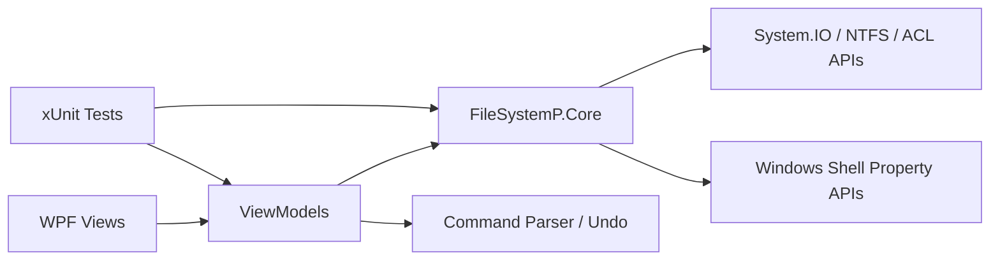
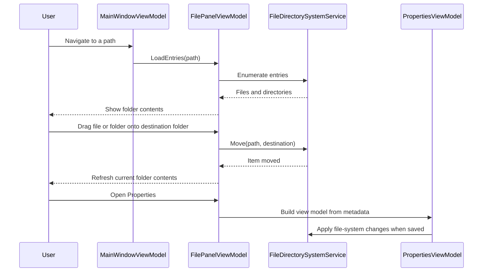
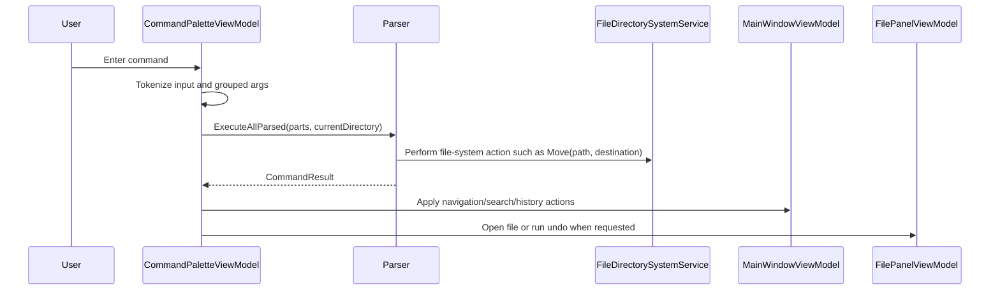

# FileSystemP

FileSystemP is a Windows desktop file explorer and file-system inspection tool built with WPF on .NET 9. The application combines everyday file navigation with advanced search, NTFS metadata inspection, editable file attributes, Windows shell property viewing, and ACL-based permission management.

## Highlights

- Drive-based explorer with folder tree and content panel
- Breadcrumb navigation with back and forward history
- Context-menu file operations for rename, move, delete, create, copy, paste, and undo
- Built-in terminal command palette with file-system, navigation, and keybinding commands including `mv`, `set`, `binds`, and `resetbinds`
- Detached terminal window that can be opened from the toolbar or with `F12`
- Advanced search across names, extensions, attributes, size, and timestamps
- Properties dialog with general, details, and security tabs
- Editable NTFS-oriented attributes including read-only, hidden, archive, indexing, and compression
- Windows ACL inspection and permission editing
- Light and dark theme selection based on the current Windows theme

## Solution Overview

| Project | Purpose |
| --- | --- |
| `src/FileSystemP.Core` | File-system, metadata, search, attribute, and security services |
| `src/FileSystemP.WPF` | WPF desktop application using an MVVM-style structure |
| `tests/FileSystemP.Tests` | xUnit test suite for core services and selected view models |

## Architecture Snapshot



## Main Workflows





## Requirements

- Windows
- .NET SDK 9.0
- NTFS volume for compression-related features
- Sufficient permissions to read or modify the selected files, folders, and ACLs

## Build

```powershell
dotnet build .\FileSystemP.sln
```

## Run

```powershell
dotnet run --project .\src\FileSystemP.WPF\FileSystemP.WPF.csproj
```

## Test

```powershell
dotnet test .\tests\FileSystemP.Tests\FileSystemP.Tests.csproj
```

## Documentation Map

- [Architecture](docs/architecture.md)
- [User Guide](docs/user-guide.md)
- [Developer Guide](docs/developer-guide.md)
- [Attribute Behavior Reference](docs/attribute-behavior.md)

## Current Platform Notes

- The application targets `net9.0-windows`.
- Compression support is explicitly limited to Windows NTFS volumes.
- Shell metadata depends on Windows shell property APIs.
- Security editing is based on Windows access control lists and Windows identities.
- Keyboard shortcuts are stored per user in `%LocalAppData%\FileSystemP\ffsystem_settings.json` and validated on startup.
- Terminal grouped arguments use backticks, for example:

```text
mkfilewith notes.txt `hello world`
open `C:\My Folder\file.txt`
```

## License

This repository is distributed under the terms of the [LICENSE](LICENSE).
