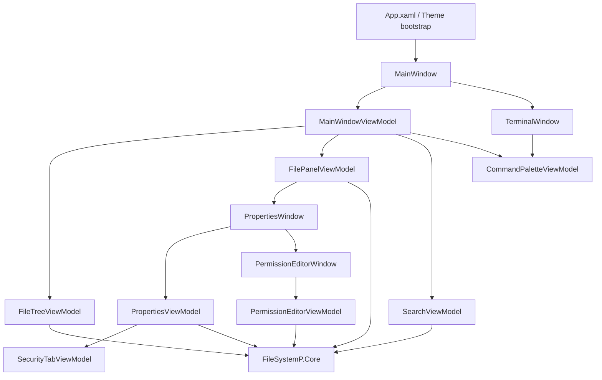
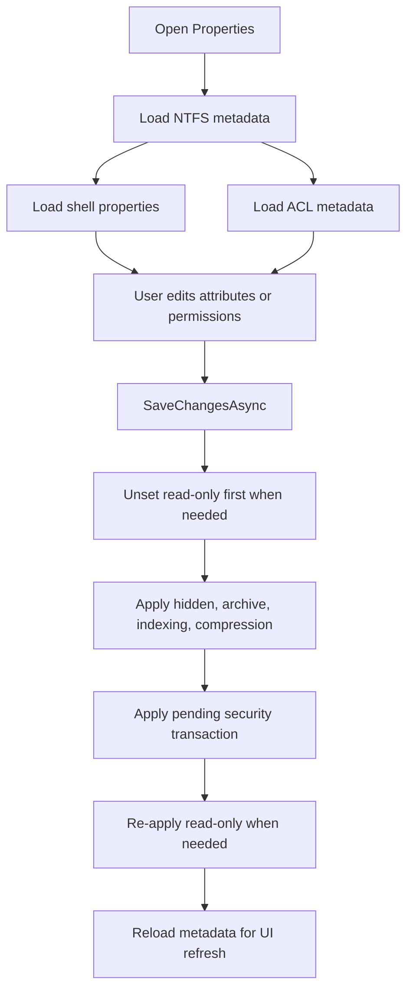

# Architecture

## Purpose

FileSystemP is structured as a small, layered Windows application:

- `FileSystemP.WPF` owns presentation, interaction flow, and view-state management.
- `FileSystemP.Core` owns file-system operations, metadata access, search logic, attribute manipulation, and security services.
- `FileSystemP.Tests` validates business behavior and selected UI-facing view-model behavior.

This separation keeps Windows UI code away from the lower-level file-system and metadata logic, which makes the core behavior easier to test and reuse.

## High-Level Structure

## WPF Layer

### Entry and theme initialization

`App.xaml.cs` selects either `Themes/Light.xaml` or `Themes/Dark.xaml` at startup by reading the current Windows personalization registry value.

### Main window

`MainWindow.xaml` is the main shell of the application. It combines:

- a breadcrumb header for path navigation
- a toolbar for history navigation, undo, and search access
- an explorer sidebar with a drive-based tree
- a search sidebar with advanced filters
- a list-based content panel for the current folder
- drag-and-drop move support from the content panel into folders in the panel or explorer tree
- an embedded terminal host that can be swapped out for a detached terminal window

### View-model responsibilities

| View model | Responsibility |
| --- | --- |
| `MainWindowViewModel` | Coordinates navigation, path history, breadcrumb generation, top-level composition, and keybinding-driven UI actions |
| `FileTreeViewModel` | Exposes ready drives as explorer roots |
| `FileTreeNode` | Lazily expands subdirectories when a tree node is opened |
| `FilePanelViewModel` | Loads folder contents and performs rename, move, delete, create, copy, paste, undo, and properties actions |
| `SearchViewModel` | Builds advanced search criteria, runs cancellable search, and projects results into the file panel |
| `CommandPaletteViewModel` | Tokenizes terminal input, invokes command parsing, and maps `CommandResult` responses into UI actions |
| `PropertiesViewModel` | Aggregates NTFS metadata, shell metadata, editable attributes, and security state |
| `SecurityTabViewModel` | Adapts security metadata into a compact UI view |
| `PermissionEditorViewModel` | Builds ACL change transactions from user edits |
| `AdvancedAttributesViewModel` | Manages advanced attribute changes before they are committed |

### Terminal interaction layer

The terminal experience is built as a shared view-model plus two possible hosts:

- `CommandPaletteView` is the reusable terminal UI surface.
- `MainWindow.xaml` contains the embedded host.
- `TerminalWindow` hosts the same terminal UI in a detached window.

`MainWindowViewModel` controls whether the terminal is embedded or detached. Closing the detached window resets the terminal session and restores the embedded host.

## Core Layer

### Service groups

The core library is organized by behavior rather than by UI feature:

- `Services`
- `SearchService`
- `AttributeService`
- `MetadataService`

### File-system services

`FileDirectorySystemService` provides the basic CRUD-style operations used by the explorer:

- enumerate direct children of a folder
- rename files and directories
- move files and directories
- delete files and directories
- create files and directories
- create files with initial content
- copy files and directories (recursive)
- read file bytes

`UndoService` tracks undoable file-system actions such as rename, move, create, delete, and selected copy flows so both toolbar and terminal commands can revert recent operations.

`KeyBindingSettingsService` stores, validates, normalizes, and restores per-user keyboard shortcuts in `%LocalAppData%\FileSystemP\ffsystem_settings.json`.

### Command subsystem

The command subsystem lives in `FileSystemP.Core/CommandService` and is composed around:

- `Parser`
- `AvailableCommands`
- `CommandResult`
- command payload records such as file content, file lines, and `cd` results

The parser is intentionally UI-agnostic. It receives a `List<string>` plus the current directory and returns a structured `CommandResult` that the WPF layer interprets. This keeps command validation and command-side business rules in the core project rather than in the view model.

Supported command areas currently include:

- file-system mutation: `rename`, `mv`, `del`, `mkdir`, `mkfile`, `mkfilewith`, `cp`
- navigation and window actions: `cd`, `back`, `forward`, `home`, `search`, `hidden`, `open`, `prop`, `undo`
- keybinding management: `set`, `binds`, `resetbinds`
- discovery and help: `help`, `helpflags`, `explain`, `explainall`, `ls`, `find`, `rfilecont`

`DriveService` returns ready drives and allows lookup by drive name.

### Search subsystem

`SearchService` performs recursive or top-level enumeration and filters entries by:

- target type
- name pattern
- extension list
- file attributes
- size thresholds or exact size
- created, modified, and accessed timestamps

The search implementation is cancellation-aware and intentionally ignores inaccessible or problematic directories instead of failing the whole search.

### Metadata subsystem

The metadata layer is split by source:

- `NtfsMetadataProvider` exposes file and directory metadata such as names, paths, timestamps, size, and raw attributes.
- `ShellMetadataProvider` uses Windows shell property APIs to expose detail-tab style properties.
- `SecurityMetadataProvider` reads owner, group, and ACL entries from Windows access control metadata.

### Attribute subsystem

The attribute services encapsulate editable attribute behavior:

- `ArchiveAttributeService`
- `HiddenAttributeService`
- `NotContentIndexedAttributeService`
- `ReadonlyAttributeService`
- `CompressAttributeService`

Compression is implemented with explicit Win32 interop and is not treated as a simple bit toggle. That distinction matters because NTFS compression is an actual file-system operation with platform and volume constraints.

### Security editing subsystem

Security changes are represented as a transaction model:

- `SecurityTransaction`
- `PermissionChange`
- `PermissionEntryRecord`

`PermissionEditorViewModel` computes the delta, while `SecurityModifierService` applies the result to the file or directory ACL.

## Properties Workflow

## Error Handling Approach

The codebase uses a project-specific `AppException` to wrap many lower-level failures and preserve the originating service or method name. In the UI layer, most operation failures are surfaced to the user through dialogs or inline error messages rather than terminating the application.

Terminal tokenization errors, such as an unmatched backtick in a grouped argument, are handled in the WPF layer before a command is sent to the core parser. That keeps user-facing input errors separate from core command semantics.

Keybinding settings are also validated at startup so malformed or conflicting shortcut definitions are repaired before the main window tries to execute them.

## Testing Strategy

The test suite focuses on:

- file-system service behavior
- attribute semantics
- search filtering
- command parser behavior and command payload semantics
- NTFS metadata extraction
- shell metadata access
- ACL metadata and mutation behavior
- selected view-model behavior around properties, permission editing, terminal commands, and detached-terminal state

Platform-dependent areas, especially compression and Windows ACL behavior, are guarded by environment-sensitive tests or assumptions.

## Known Boundaries

- Search is implemented as in-memory result accumulation
, which is simple and clear but not optimized for very large result sets.
- Directory size calculation in `NtfsMetadataProvider` walks all descendant files recursively.
- Security editing is tightly coupled to Windows ACL semantics.
