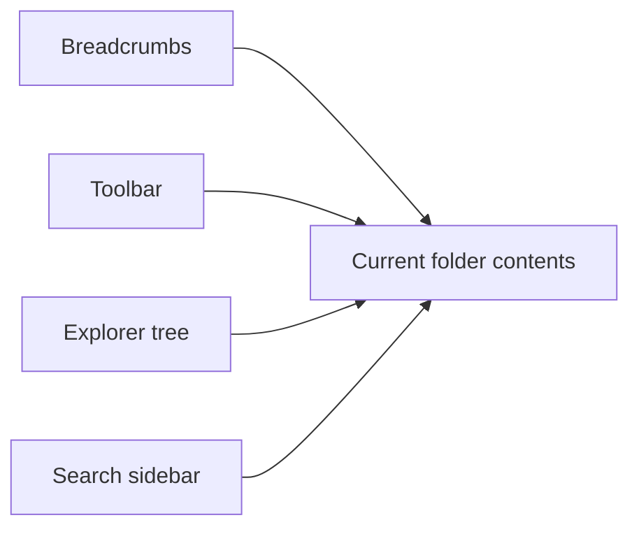
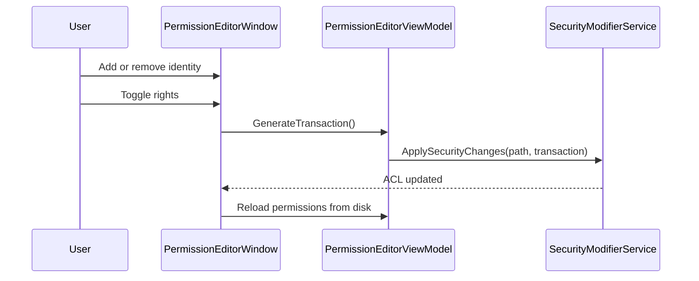

# User Guide

## Overview

FileSystemP provides a familiar explorer-style interface for browsing drives and folders while exposing more metadata and control than a basic file list.

## Main Interface

The window is divided into three main areas:

- the breadcrumb and toolbar area at the top
- the left sidebar for the explorer tree and search panel
- the right content area showing files and folders in the current location

## Navigation

### Explorer tree

- The tree starts from all ready drives returned by Windows.
- Expanding a node loads subdirectories on demand.
- Selecting a directory in the tree navigates the content panel to that location.

### Breadcrumbs

- The breadcrumb bar shows the current path as clickable segments.
- Clicking a segment jumps directly to that location.

### History

- `Back` returns to the previous path in navigation history.
- `Forward` moves forward again after going back.

## Working with Files and Folders

The content panel supports context-menu operations on files and folders.

### Available actions

- Open
- Rename
- Delete
- Copy
- Paste
- New File
- New File with Content
- New Folder
- Properties
- Undo for recent create, rename, and paste actions

### Notes

- Double-clicking a folder navigates into it.
- Double-clicking a file opens it through the Windows shell.
- Copy and paste support both files and folders. For folders, the copy is recursive and includes all subfolders and files.

## Search

The Search tab supports multi-criteria search within the current location.

### Available filters

- Name pattern
- Target type: files, directories, or both
- Recursive or top-level scope
- Extension list
- Attributes: read-only, hidden, archive, system
- Size: above, exact, or below
- Created date
- Modified date
- Accessed date

### Search behavior

- The search runs against the current path.
- Recursive search traverses subfolders.
- The result list is shown in the same content panel used for folder browsing.
- Search can be canceled while it is in progress.
- Inaccessible folders and certain I/O errors are skipped so the search can continue.

## Properties Dialog

The Properties dialog is the center of the inspection and editing experience.

### General tab

The General tab displays:

- name and type
- location and full path
- size
- created, modified, and accessed timestamps
- standard editable attributes
- file-system parent and root information

### Details tab

The Details tab displays Windows shell properties gathered from the system property store for the selected file or directory.

### Security tab

The Security tab displays:

- object path
- owner
- effective permission summary grouped by user or group
- a compact `rwx` representation alongside Windows rights text

## Attribute Editing

Editable attributes include:

- Read-only
- Hidden
- Archive
- Content indexing participation
- Compression

For directories, FileSystemP can apply certain changes recursively.

For the detailed semantics of each attribute, see [Attribute Behavior Reference](attribute-behavior.md).

## Advanced Attributes

The `Advanced...` button opens a dedicated dialog for:

- archive state
- content indexing state
- compression state
- recursive application options for folders

Compression is only available when the target is on a Windows NTFS volume.

## Permission Editing

The permission editor allows Windows user and group permissions to be updated.

### Supported editing model

- identities can be added through the Windows object picker
- explicit permissions can be removed or replaced
- inherited permissions remain visible and affect what can be edited
- rights are modeled primarily as read, write, execute, and full control

## Themes

The application automatically selects a light or dark resource dictionary based on the current Windows app theme setting.

## Platform Considerations

- The application is designed for Windows.
- Compression depends on NTFS support.
- Shell details depend on Windows shell property support.
- Security editing depends on Windows ACL and identity resolution.
